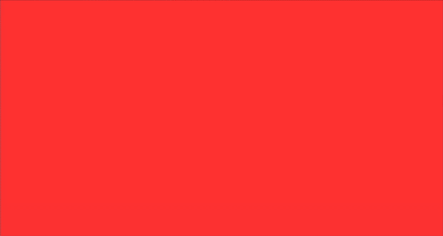

# CubeASCII

A tiny raycaster, written as a single small file of C, that renders ASCII graphics in your terminal.

This project is a minimalist version of the Cube3D assignment (inspired by Wolfenstein 3D), where rendering is done using terminal characters instead of a graphical window.



## Compilation and Execution

Compile using gcc or clang :

```bash
gcc -o cubeascii cubeascii.c -lm
```

Then, run it in a **POSIX terminal**:

```bash
./cubeascii
```
Your terminal should support 256-color mode. If it doesn't, the terminal will fallback on ANSI-color (ugly).
Tested with gnome-terminal on Ubuntu 22.04, Konsole and foot on openSUSE. 

WSL with the default non-posix Windows 11 terminal will causes some ugly flickering due to (i assume) the way it handles screen clearing, using gnome-terminal or any posix terminal inside wsl fixes it.

You can adjust the screen resolution by editing the following macros in `cubeascii.c`:
```c
#define SCREEN_WIDTH  180
#define SCREEN_HEIGHT 105
```

You will need to **unzoom** your terminal if you want to support higher resolution. These values are for unzoomed KDE Konsole.

## How does raycasting work?

Rendering is done one vertical column at a time, from left to right, wich are then printed row by row in the second loop in the render() function.

read the extensive comments in the C file, i'll update this one day.

maybe.

## Ressources

Wolfenstein3D-style raycasting :
- This **brilliant** raycasting breakdown by Lode Vandevenne :
https://lodev.org/cgtutor/raycasting.html.
It was my main guide for the implementation of the raycasting algorithm, it's really good.

- This one by F. Permadi is really good too, it has great images : https://permadi.com/1996/05/ray-casting-tutorial-table-of-contents/

In a broader scope :

- https://en.wikipedia.org/wiki/Ray_casting#Concept
- https://en.wikipedia.org/wiki/Digital_differential_analyzer_(graphics_algorithm)
- https://people.computing.clemson.edu/~dhouse/courses/405/notes/raycast.pdf 
(This one tackles ray casting in a broader approach on more complexe geometry, so not really suited for this project, but still very interesting)
